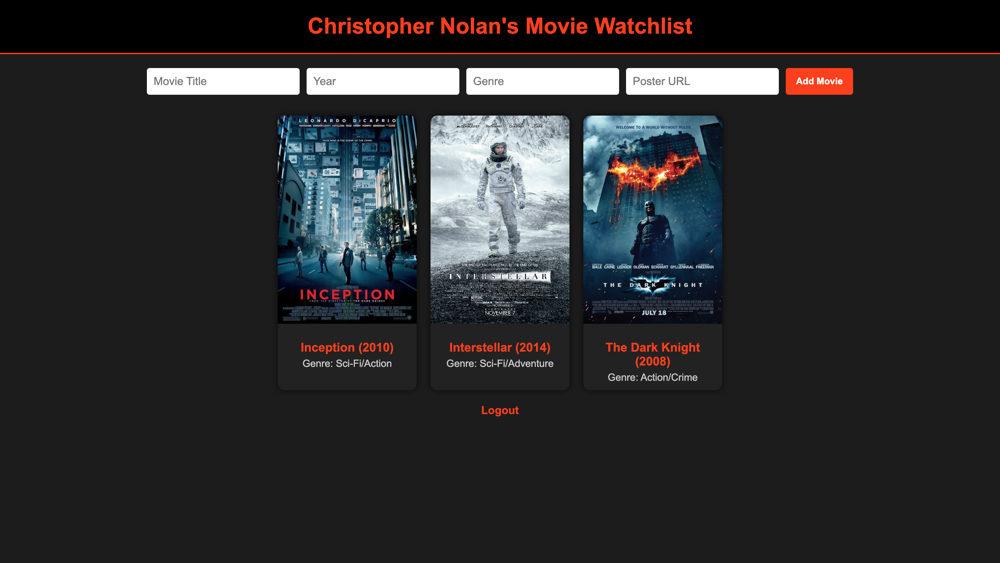

# Movie Watchlist App 🍿

### Description
User can Login/Sign up to make an account for the Movie Watchlist App and from there can add movies that they want to see or have already saw. The user will manually add the title, year, genre, and can add a movie poster picture.

### Tech Used:

- HTML
- CSS
- Javascript
- MongoDB
- Node.js

### Lessons Learned:
- How to create and manage a database collection with MongoDB
- How to set up an Express server and define routes for different pages.
- How to loop through arrays and display data using <% %> and <%= %> syntax.

## Installation

1. Clone repo
2. run `npm install`

## Usage

1. run `node server.js`
2. Navigate to `localhost:3210`

## Credit

Modified from Scotch.io's auth tutorial
